# 堆内存分配

runtime 将堆地址空间划分为一个一个arena

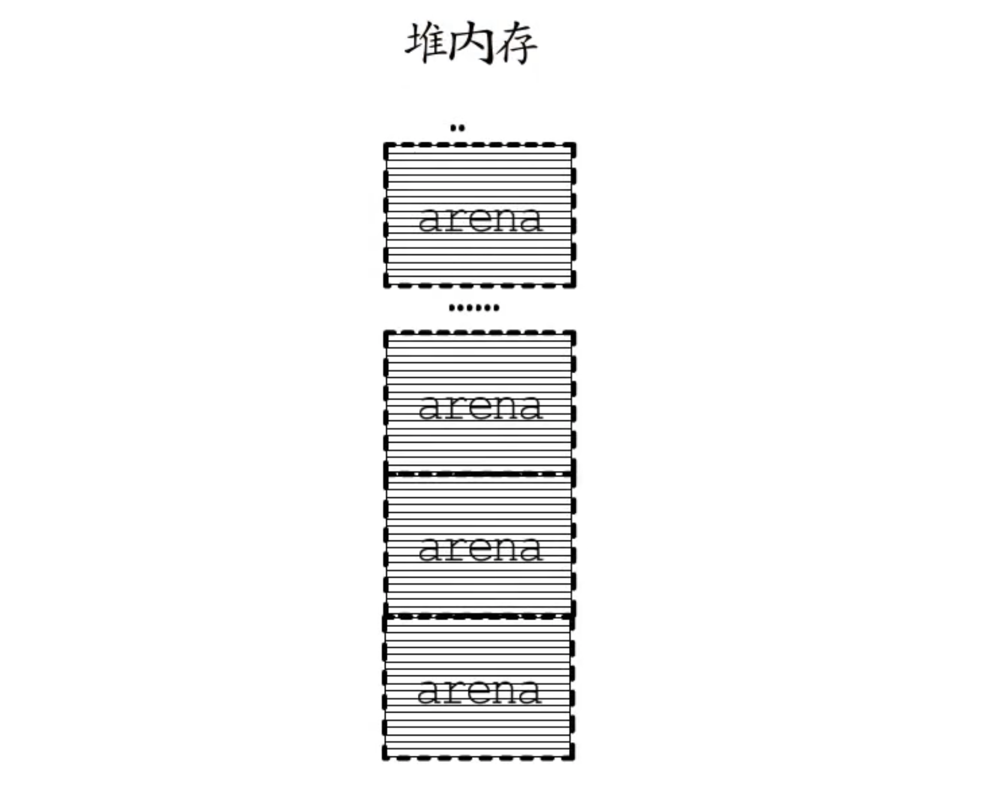

arena区域的起始地址被定义为常量arenaBaseOffset，在AMD64架构的Linux环境下每个arena的大小是64MB，起始地址也对齐到64MB，每个arena包含8192个page，所以每个page打小为8kb

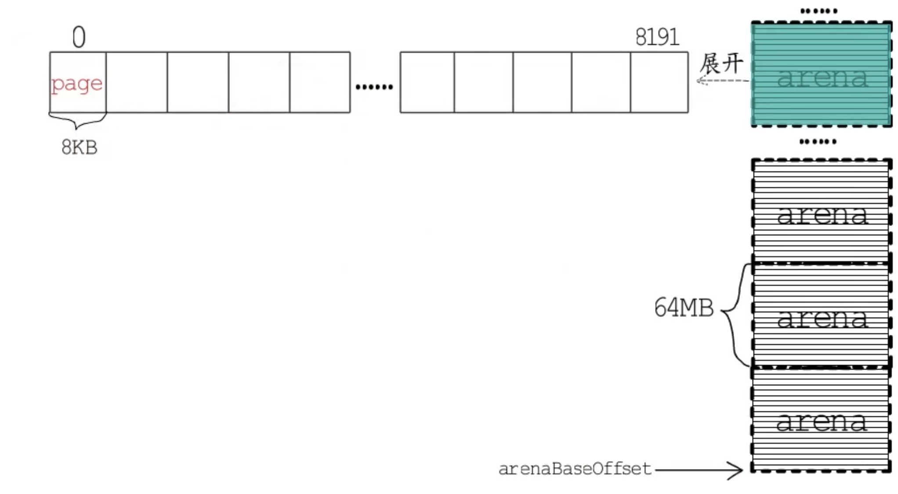

因为程序运行起来所需要分配的内存块有大有小，而分散的、大小不一的碎片化内存，一方面可能降低内存使用率，另一方面要找到大小合适的内存块的代价，会因碎片化而增加。

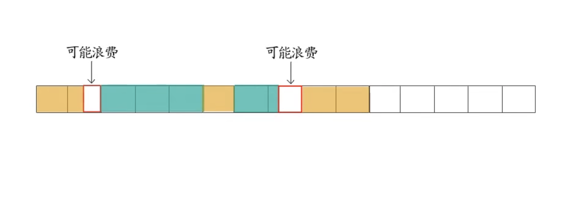

为降低碎片化内存给程序性能造成的不良影响，go语言的堆分配采用了与tcmalloc内存分配器类似的算法，简单来讲就是按照一组预置的大小规格把内存页划分成块，然后把不同规格的内存块放入对应的空闲链表中，程序申请内存时，分配器会先根据要申请的内存大小，找到最匹配的规格，然后从对应空闲链表中分配一个内存块，Go 1.16 runtime包给出了 67 种预置的大小规格，最小 8 字节 ，最大 32 k。


所以在划分的整整齐齐的arena里，又会按需划分出不同的span，每个 span 包含一组连续的 page ，并且按照特定规格，划分成了等大的内存块。

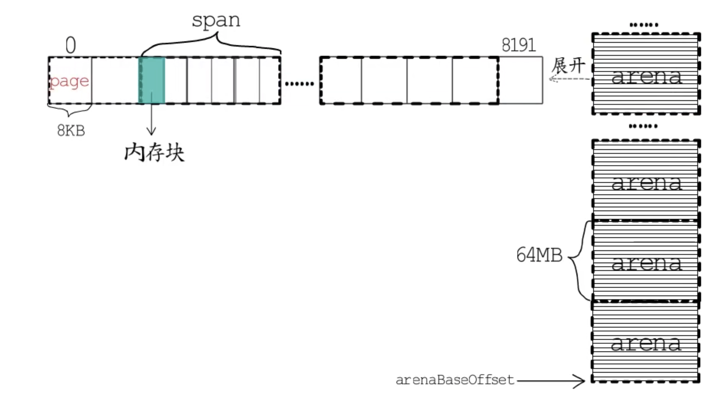

arena, span, page和内存块组成了堆内存，而在堆内存之外，有一票用于管理堆内存的数据结构。


mheap 用于管理整个堆内存 ，一个arena对应一个heapArena结构，一个span对应一个mspan结构。通过它们可以知道某个内存块是否已分配；已分配的内存用作指针还是标量；是否已被GC标记；是否等待清扫等信息，mheap 中有一个全局msanp管理中心，它是一个长度为136的数组，数组元素是一个mcentral 结构， 加上一个padding。


mcentral 怎么管理mspan呢？

```
type mcentral struct {
   spanclass spanClass
   partial   [2]spanSet
   full      [2]spanSet
}
```

一个mcentral 对应一种mspan规格类型，记录在spanclass中，spanclass 高七位标记内存卡大小规格编号，runtime提供的预置变化对应1～67 [8b, 32kb]， 编号 0 留出来对应大于32kb内存。

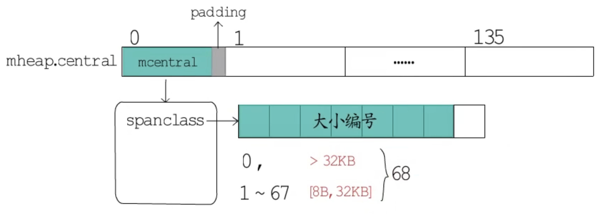

每种规格会按照是否不需要GC扫描，进一步区分，用最低位来标识，包含指针的需要GC扫描，归为scannable 一类， 不含指针的归为 noscan 一类，所以一共分为136种，每种spanclass 的 mcentral 中会进一步将已用尽与未用尽的mspan分别管理，每一种又会放到两个并发安全的set 种，一个是已清扫的，一个是未清扫的。

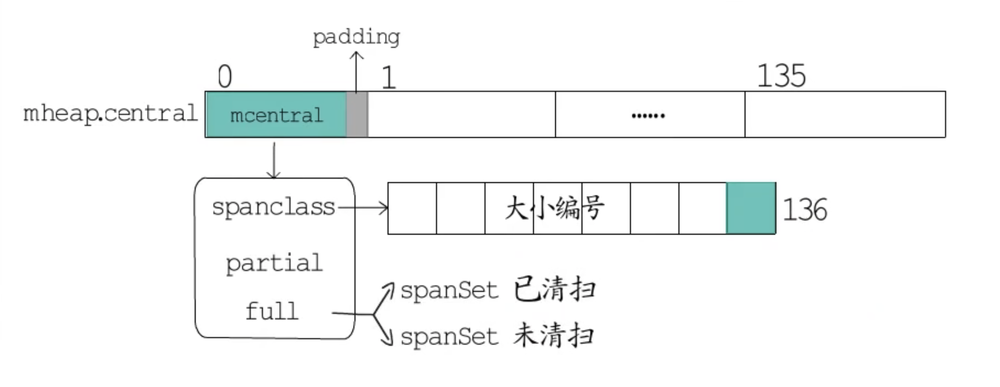

全局mspan管理中心，方便取用各种规格类型的mspan。但是为保障多个P之间并发安全，免不了频繁加锁、解锁。为降低多个P之间的竞争性，Go语言的每个P都有一个本地小对象缓存，也就是mcache，从这里取用就不用再加锁了。


mcache这里有一个长度为136的、*mspan类型的数组，还有专门用于分配小于16字节的noscan类型的tiny内存。

```go
type mcache struct {
   nextSample uintptr
   scanAlloc  uintptr
   tiny       uintptr
   tinyoffset uintptr
   tinyAllocs uintptr
   alloc      [numSpanClasses]*mspan
   stackcache [_NumStackOrders]stackfreelist
   flushGen   uint32
}
```

当前P需要用到特定规格类型的mspan时，先去本地缓存这里找对应的mspan；如果没有或者用完了，就去mcentral这里获取一个放到本地，把已用尽的归还到对应mcentral的full set中。

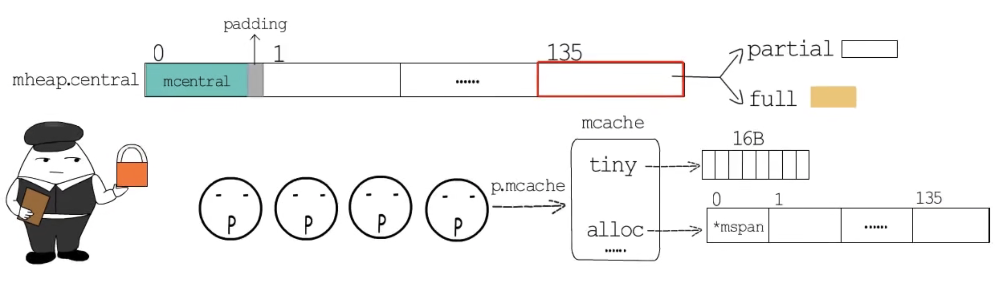

**heapArena**

heapArena是在Go的堆之外分配和管理的，其结构定义代码如下：

```go
type heapArena struct {
   bitmap       [heapArenaBitmapBytes]byte
   spans        [pagesPerArena]*mspan
   pageInUse    [pagesPerArena / 8]uint8
   pageMarks    [pagesPerArena / 8]uint8
   pageSpecials [pagesPerArena / 8]uint8
   checkmarks   *checkmarksMap
   zeroedBase   uintptr
}
```

heapArena这里存储着arena的元数据，里面有一群位图标记。

- **heapAreana.bitmap**

**bitmap位图：**
（1）用一位标记这个arena中，一个指针大小的内存单元到底是指针还是标量；
（2）再用一位来标记这块内存空间的后续单元是否包含指针。
而且为了便于操作，bitmap中用一字节标记arena中4个指针大小的内存空间：低4位用于标记指针/标量；高4位用于标记扫描/终止。
例如在arena起始处分配一个slice，slice结构包括**一个元素指针**，**一个长度，**以及**一个容量。**对应的bitmap标记位图中：
（1）第一字节的第0位到第2位标记这三个字段是指针还是标量；
（2）第4位到第6位标记三个字段是否需要继续扫描。

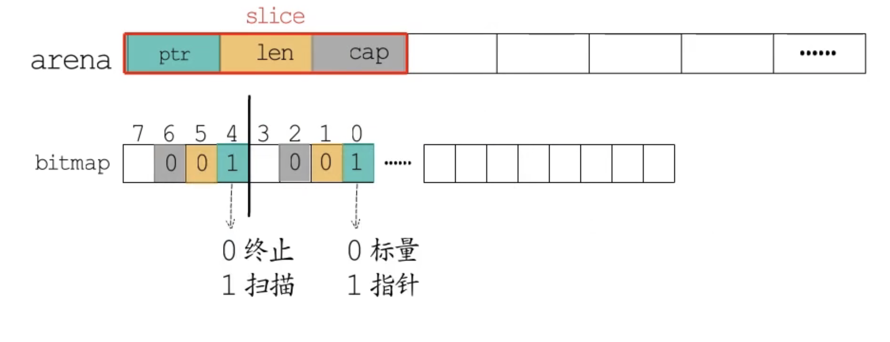

- **heapAreana.pageInUse**

  **pageInUse**是个uint8类型的数组，长度为1024，所以一共8192位。结合这个名字，看起来似乎是标记哪些页面被使用了。但实际上，这个位图只标记处于使用状态(mSpanInUse)的span的第一个page。例如arena中连续三个span分别包含1，2，3个page，pageInUse位图标记情况如下图所示：


- **heapAreana.pageMarks**

**pageMarks**这个位图看起来应该和GC标记有点儿关系，它的用法和pageInUse一样，只标记每个span的第一个page。在GC标记阶段会修改这个位图，标记哪些span中存在被标记的对象;在GC清扫阶段会根据这个位图，来释放不含标记对象的span。

- **heapArena.spans**

**spans**是个*mspan类型的数组，大小为8192，正好对应arena中8192个page，所以用于定位一个page对应的mspan在哪儿

- **mspan**

**mspan**管理着span中一组连续的page，划分的内存块规格类型记录在spanclass中。高七位标记内存块大小规格编号，runtime提供的预置规格对应编号1到67，编号0留出来，对应大于32KB的大块内存，一共68种。然后每种规格会按照是否不需要GC扫描进一步区分开来，用最低位来标识：
（1）包含指针的需要GC扫描，归为scannable这一类；
（2）不含指针的归为noscan这一类。

**所以一共分成136种。**

nelems记录着当前span共划分成了多少个内存块。freeIndex记录着下个空闲内存块的索引。与heapArena不同，mspan这里的位图标记，面向的是划分好的内存块单元，allocBits位图用于标记哪些内存块已经被分配了。gcmarkBits是当前span的标记位图，在GC标记阶段会对这个位图进行标记，一个二进制位对应span中的一个内存块。

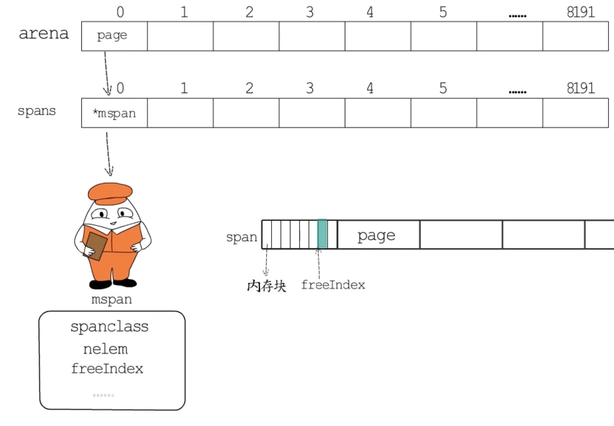
到GC清扫阶段会释放掉旧的allocBits，然后把标记好的gcmarkBits用作allocBits，这样未被GC标记的内存块就能回收利用了。当然会重新分配一段清零的内存给gcmarkBits位图
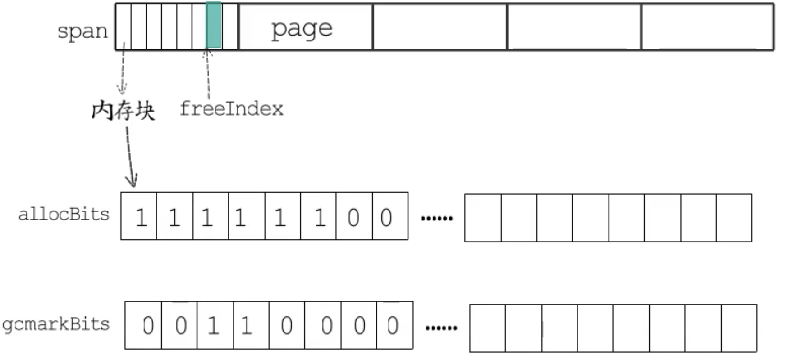
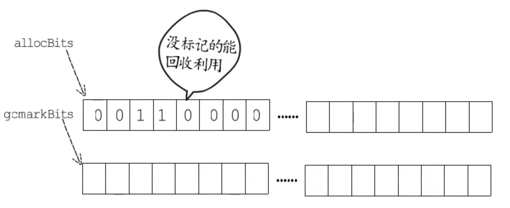

```go
type mspan struct {
   next           *mspan
   prev           *mspan
   list           *mSpanList
   startAddr      uintptr
   npages         uintptr
   manualFreeList gclinkptr
   freeindex      uintptr
   nelems         uintptr
   allocCache     uint64
   allocBits      *gcBits
   gcmarkBits     *gcBits
   sweepgen       uint32
   divMul         uint16
   baseMask       uint16
   allocCount     uint16
   spanclass      spanClass
   state          mSpanStateBox
   needzero       uint8
   divShift       uint8
   divShift2      uint8
   elemsize       uintptr
   limit          uintptr
   speciallock    mutex
   specials       *special
}
```