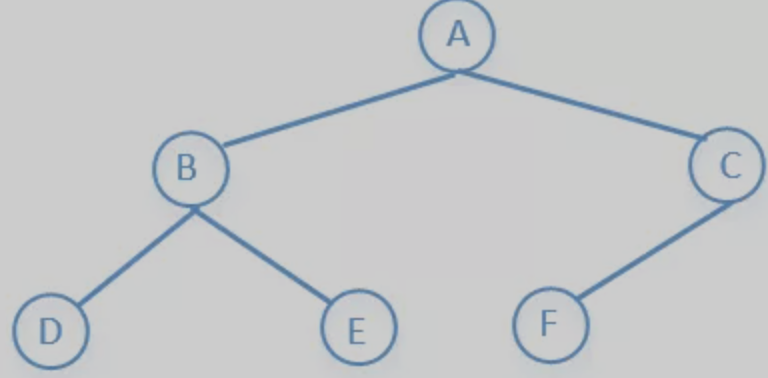
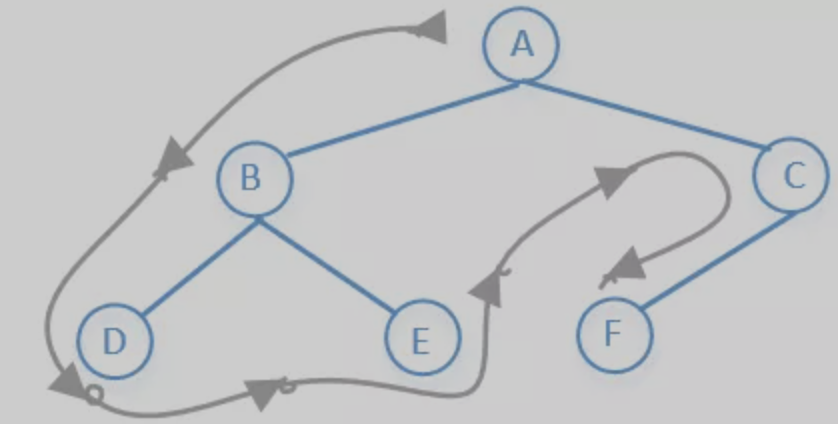
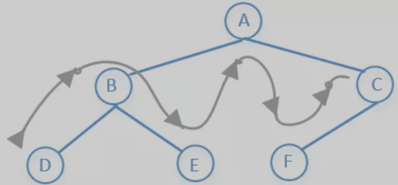
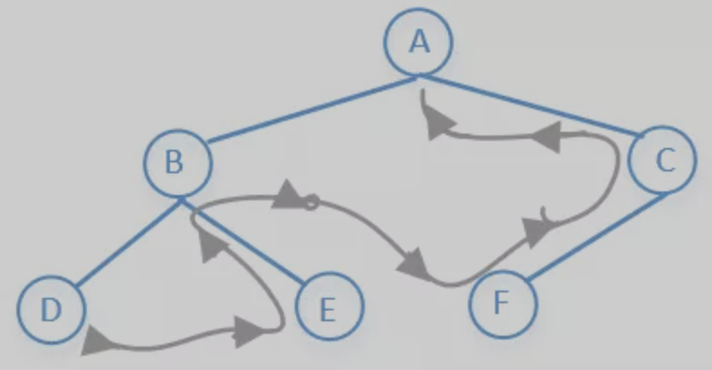
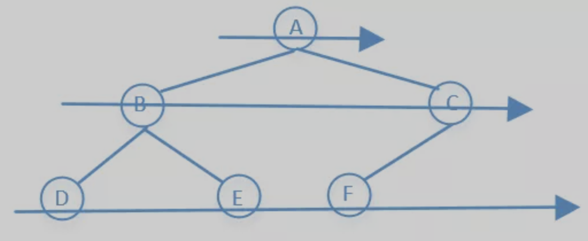

#  数据结构 - 树

###  基础知识

树是一个有n个有限节点组成一个具有层次关系的集合，每个节点有0个或者多个子节点，没有父节点的节点称为根节点，也就是说除了根节点以外每个节点都有父节点，并且有且只有一个。

树的种类比较多，有二叉树，红黑树，AVL树，B树，哈夫曼树，字典树等等。

甚至堆我们也可以把它看成是一棵树，树的这么多种类中，我们最常见的应该是二叉树了，下面我们来看一下他的结构。


###  定义

1. **结点的度：**一个结点含有的子结点的个数称为该结点的度；
2. **叶结点或终端结点：**度为0的结点称为叶结点；
3. **非终端结点或分支结点：**度不为0的结点；
4. **双亲结点或父结点：**若一个结点含有子结点，则这个结点称为其子结点的父结点；
5. **孩子结点或子结点：**一个结点含有的子树的根结点称为该结点的子结点；
6. **兄弟结点：**具有相同父结点的结点互称为兄弟结点；
7. **树的度：**一棵树中，最大的结点的度称为树的度；
8. **结点的层次：**从根开始定义起，根为第1层，根的子结点为第2层，以此类推；
9. **树的高度或深度：**树中结点的最大层次；
10. **堂兄弟结点：**双亲在同一层的结点互为堂兄弟；
11. **结点的祖先：**从根到该结点所经分支上的所有结点；
12. **子孙：**以某结点为根的子树中任一结点都称为该结点的子孙。
13. **森林：**由m（m>=0）棵互不相交的树的集合称为森林；
14. **无序树：**树中任意节点的子结点之间没有顺序关系，这种树称为无序树,也称为自由树;
15. **有序树：**树中任意节点的子结点之间有顺序关系，这种树称为有序树；
16. **二叉树：**每个节点最多含有两个子树的树称为二叉树；
17. **完全二叉树：**若设二叉树的深度为h，除第 h 层外，其它各层 (1～h-1) 的结点数都达到最大个数，第 h 层所有的结点都连续集中在最左边，这就是完全二叉树
18. **满二叉树：**除最后一层无任何子节点外，每一层上的所有结点都有两个子结点的二叉树。
19. **哈夫曼树：**带权路径最短的二叉树称为哈夫曼树或最优二叉树；


### 应用

树的种类实在是太多，关于树的算法题也是贼多，这一篇文章不可能全部介绍完，我们需要具体问题再具体分析。这里主要介绍的是二叉树，并且只介绍树的一些最基础的几个算法。我们先来看个图




#### 节点类

```java
 1public class TreeNode {
 2    public int val;
 3    public TreeNode left;
 4    public TreeNode right;
 5
 6    public TreeNode(int x) {
 7        val = x;
 8    }
 9
10    public TreeNode() {
11    }
12
13    @Override
14    public String toString() {
15        return "[" + val + "]";
16    }
17}
```


####  前序遍历

> 他的访问顺序是：根节点→左子树→右子树
>
> 所以上图前序遍历的结果是：A→B→D→E→C→F
>
> 访问顺序如下




```java
public static void preOrder(TreeNode tree) {
  if (tree == null)
    return;
	// 输出出来是 前序遍历的节点
  System.out.printf(tree.val + "");
  preOrder(tree.left);
  preOrder(tree.right);
}
```

**非递归写法**

```java
public static void preOrder(TreeNode tree) {
  if (tree == null)
    return ;
  Stack<TreeNode>q1 = new Stack<>();
  q1.push(tree);
  while(!q1.empty()) {
    TreeNode t1 = q1.pop();
    
    if (t1.right != null) {
      q1.push(t1.right);
    }
    if (t1.left != null) {
      q1.push(t1.left);
    }
  }
}
```


#### 中序遍历

> 他的访问顺序是：左子树→根节点→右子树
>
> 所以上图前序遍历的结果是：D→B→E→A→F→C
>
> 访问顺序如下



```java
public static void inOrderTraversal(TreeNode node) {
  if (node == null)
    return;
  
  inOrderTraversal(node.left);
  // 输出是中序遍历的节点
  System.out.println(node.val);
  inOrderTraversal(node.right);
}
```

**非递归写法**

```java
public static void inOrderTraversal(TreeNode tree) {
  Stack<TreeNode>stack = new stack<>();
  while (tree != null || !stack.isEmpty()) {
    while (tree != null) {
      stack.push(tree);
      tree = tree.left;
    }
    if (!stack.isEmpty()) {
      tree = stack.pop();
      System.out.println(tree.val);
      tree = tree.right;
      }
   }
}
```


####  后续遍历

> 他的访问顺序是：左子树→右子树→根节点
>
> 所以上图前序遍历的结果是：D→E→B→F→C→A
>
> 访问顺序如下




```java
public static void postOrder(TreeNode tree) {
  if (tree == null) 
    return;
  postOrder(tree.left);
  postOrder(tree.right);
  // 输出是后续遍历的节点
  print
}
```

**非递归写法**

```java
 1public static void postOrder(TreeNode tree) {
 2    if (tree == null)
 3        return;
 4    Stack<TreeNode> s1 = new Stack<>();
 5    Stack<TreeNode> s2 = new Stack<>();
 6    s1.push(tree);
 7    while (!s1.isEmpty()) {
 8        tree = s1.pop();
 9        s2.push(tree);
10        if (tree.left != null) {
11            s1.push(tree.left);
12        }
13        if (tree.right != null) {
14            s1.push(tree.right);
15        }
16    }
17    while (!s2.isEmpty()) {
18        System.out.print(s2.pop().val + " ");
19    }
20}	
```

**或者**

```java
 1public static void postOrder(TreeNode tree) {
 2    if (tree == null)
 3        return;
 4    Stack<TreeNode> stack = new Stack<>();
 5    stack.push(tree);
 6    TreeNode c;
 7    while (!stack.isEmpty()) {
 8        c = stack.peek();
 9        if (c.left != null && tree != c.left && tree != c.right) {
10            stack.push(c.left);
11        } else if (c.right != null && tree != c.right) {
12            stack.push(c.right);
13        } else {
14            System.out.print(stack.pop().val + " ");
15            tree = c;
16        }
17    }
18}
```


####  BFS(宽度优先搜索(又称广度优先搜索))

> 他的访问顺序是：先访问上一层，在访问下一层，一层一层的往下访问
>
> 所以上图前序遍历的结果是：A→B→C→D→E→F
>
> 访问顺序如下





```java
 1public static void levelOrder(TreeNode tree) {
 2    if (tree == null)
 3        return;
 4    LinkedList<TreeNode> list = new LinkedList<>();//链表，这里我们可以把它看做队列
 5    list.add(tree);//相当于把数据加入到队列尾部
 6    while (!list.isEmpty()) {
 7        TreeNode node = list.poll();//poll方法相当于移除队列头部的元素
 8        System.out.println(node.val);
 9        if (node.left != null)
10            list.add(node.left);
11        if (node.right != null)
12            list.add(node.right);
13    }
14}
```

